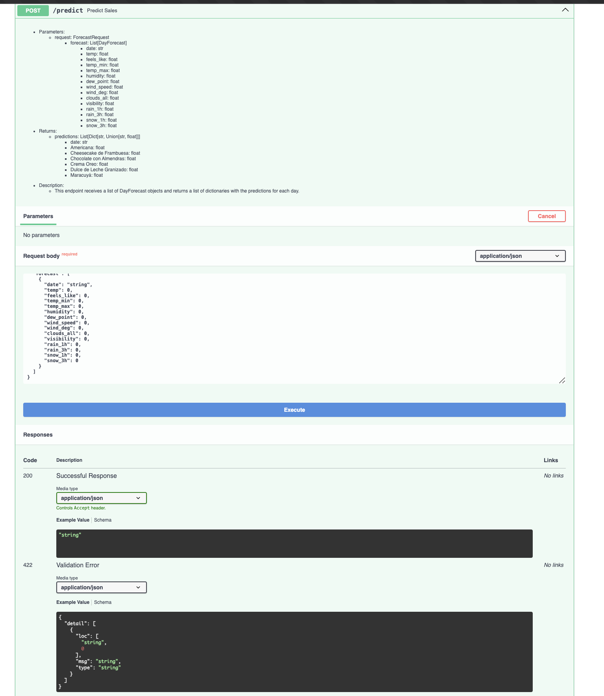

# ScoopCast: Ice Cream Sales Prediction Based On Weather Forecast

 This project combines machine learning, sales predictions to provide actionable insights for ice cream businesses. Dive in to explore the features, setup instructions, and API interface using FastAPI.

---

## Repository Structure

```plaintext
ScoopCast/
├── data/                     # Dataset files
├── model/                    # Trained machine learning models
├── model_training/           # Notebooks and scripts for training models
│   └── train.ipynb
├── results/                  # Results and visualizations
│   ├── api_interface.png
│   └── graph.py
├── api.py                    # FastAPI application
├── README.md                 # Project documentation
files
```

---

## Project Overview

**ScoopCast** is designed to:
1. Predict ice cream sales based on weather conditions.
2. Forecast weather metrics like temperature, humidity, and rainfall.
3. Provide an easy-to-use API for integrating these predictions into other systems.

### Key Features:
- **Weather Forecasting**: Generates 7-day weather forecasts.
- **Sales Predictions**: Estimates daily ice cream sales across multiple flavors.
- **API Integration**: FastAPI-based interface for real-time data retrieval.
- **Visualization**: Graphs and images for better insights.

#### API Interface


---

## Setup Instructions

### Prerequisites
Ensure you have the following installed on your system:
- Python 3.8+
- pip (Python package installer)
- Virtual environment tool (optional but recommended)

### Installation
1. Clone this repository:
   ```bash
   git clone https://github.com/aaqib-ahmed-nazir/ScoopCast.git
   cd ScoopCast
   ```

2. Set up a virtual environment:
   ```bash
   python3 -m venv .venv
   source .venv/bin/activate  # On Windows: .venv\Scripts\activate
   ```

3. Install dependencies:
   ```bash
   pip install -r requirements.txt
   ```

4. Verify the setup:
   ```bash
   python --version
   pip list
   ```

---

## Running the Project

### Step 1: Train the Model
Navigate to the `model_training` folder and run the ipynb:
```bash
train2.ipynb
```

### Step 2: Run the API
Start the FastAPI server:
```bash
uvicorn api:app --reload
```

### Step 3: Access the Swagger Documentation
Open your browser and go to:
[https://127.0.0.1:8000/docs](https://127.0.0.1:8000/docs)

This will display the interactive Swagger UI for testing the API endpoints.

---

## API Endpoints
The API provides the following endpoints:
- `/predict` - Retrieve sales predictions based on weather data.
---

## Contributing
Feel free to fork this repository, create a new branch, and submit a pull request. Suggestions and improvements are always welcome!

---
## License
This project is licensed under the [MIT License](https://opensource.org/license/mit). See the LICENSE file for details.

---
